# Cryptographic Security for Internet: TLS/SSL, VPN/SSL vs. VPN/IPsec

Origin blog: https://hackmd.io/@mhud/mmt-group-5

## Team Members — Group 5
- **To Gia Hao**
- **Nguyen Thanh Quan**
- **Lam Chi Van**
- **Duong Tien Vinh**

---

## TLS/SSL

- SSL stand for **S**ecure **S**ocket **L**ayer.
- TLS mean **T**ransport **L**ayer **S**ecuriy.

> TLS/SSL both is a cryptographic protocol that aids in the security of computer network communications.

### 1. TLS/SSL history:

- **SSL 1.0**: unpublished. SSL 1.0 was developed by Netscape
- **SSL 2.0**: published in Nov.1994 with several weakness, did not have client authentication
- **SSL 3.0**: published in Nov.1996 and improved by _Paul Kocher_, However, there are many vulnerabilities that cannot be further developed, and SSL is also less used today than TLS. MT
- **TLS 1.0**:
  - Published in Jan.1999, TLS 1.0 based on SSL 3.0.
  - It was using HMAC instead of MAC.
  - TLS can run on any port.
- **TLS 1.1 and TLS 1.2**
- **TLS 3.0**: This is the latest release, which was published on 21 March 2018.

### 2. Benefits of TLS:

- **Interoperality**: TLS/SSL is compatible with the majority of web browsers, including Microsoft Internet Explorer, as well as the majority of operating systems and web servers.
- **Ease of deployment**: Many TLS/SSL apps are temporarily installed on Windows Server 2003 operating systems.
- **Ease of use**: Because we implement TLS/SSL beneath the application layer, most of its operations are completely invisible to client.
- **Encryption**: TLS/SSL can help to secure transmitted data using encryption
- **Algorithm flexibility**: TLS/SSL provides operations for authentication mechanism, encryption algorithms and hashing algorithm that are used during the secure session.

### 3. Secure Socket Layer Protocols:

There are four type of protocols:

- SSL Record protocol
- Handshake protocol
- Alert protocol
- Change cipher Spec protocol

#### SSL record protocol

- SSL Record provides two services to SSL connection.
  - Confidentiality
  - Message Integrity
- In the SSL Record Protocol application data is divided into fragments. The fragment is compressed and then encrypted MAC (Message Authentication Code) generated by algorithms like SHA (Secure Hash Protocol) and MD5 (Message Digest) is appended. After that encryption of the data is done and in last SSL header is appended to the data.

#### Handshake protocol

- **Handshake Protocol** is used to establish sessions. This protocol allows the client and server to authenticate each other by sending a series of messages to each other. Handshake protocol uses four phases to complete its cycle.
  - **Phase 1**: Both Client and Server send hello-packets to each other. In this IP session, cipher suite and protocol version are exchanged for security purposes.
  - **Phase 2**: Server sends his certificate and Server-key-exchange. The server end phase-2 by sending the Server-hello-end packet.
  - **Phase 3**: Client reply to the server by sending his certificate and Client-exchange-key.
  - **Phase 4**: Change-cipher suite occurred and after this Handshake Protocol ends.

#### Alert protocol

- Used to transmit warnings to the other party such as the security cannot be established when the information is given from the available options, the certificate received is invalid, or the certificate has expired registration...
- The level is further classified into two parts:
  - **Warning**: This Alert has no impact on the connection between sender and receiver.
  - **Fatal Error**: This Alert breaks the connection between sender and receiver.

#### Change cipher Spec protocol

- This protocol uses the SSL record protocol. Unless Handshake Protocol is completed, the SSL record Output will be in a pending state. After handshake protocol, the Pending state is converted into the current state.
- Change-cipher protocol consists of a single message which is 1 byte in length and can have only one value. This protocol’s purpose is to cause the pending state to be copied into the current state.

### Difference between SSL and TLS:

<table>
    <tbody>
        <tr>
            <th style="text-align:center"> SSL </th>
            <th style="text-align:center"> TLS </th>
        </tr>
        <tr>
            <td style="text-align:center"> Support Fortezza algorithm </td>
            <td style="text-align:center"> Does not support </td>
        </tr>
        <tr>
            <td style="text-align:center"> The 3.0 Version </td>
            <td style="text-align:center"> The 1.0 version </td>
        </tr>
        <tr>
            <td style="text-align:center"> Message digest is used to create master secret </td>
            <td style="text-align:center"> Pseudo-random function is used to create master secret </td>
        </tr>
        <tr>
            <td style="text-align:center"> Message authentication Code protocol is used </td>
            <td style="text-align:center"> Hashed message Authentication Code protocol is used </td>
        </tr>
        <tr>
            <td style="text-align:center"> Complex than TLS </td>
            <td style="text-align:center"> Simple </td>
        </tr>
        <tr>
            <td style="text-align:center"> Less security </td>
            <td style="text-align:center"> Provide high security </td>
        </tr>
    </tbody>
</table>

---

## VPN

- **Meaning:** **V**irtual **P**rivate **N**etwork
- To establish a protected network connection when using public networks.
- Using a VPN will hide your real IP address and encrypt your internet connection.

### Benefit of using VPN:

- Ensure your online privacy
- Improve your Internet connection and speed
- Secure data transfer
- Access to regional content

---

## VPN/SSL

### About VPN/SSL:

```mermaid
flowchart LR
    subgraph intranet["Intranet"]
        webserver["🌐 Web server"]
        mailserver["📫 Mail server"]
        ftp["📁 FTP server"]
    end

    subgraph internet["☁️ Internet"]
        tunnel("SSL VPN Tunnel")
    end

    user["🧑‍💻 Remote User"] --> tunnel --> firewall["🔥 Firewall"] --> gateway["🚧 SSL VPN\nGateway"] --"✅"--> webserver & mailserver & ftp

    style tunnel fill:pink,stroke:white
```

- An SSL VPN uses the **S**ecure **S**ockets **L**ayer (SSL) protocol – or the Transport Layer Security (TLS) protocol – in web browsers to provide users with the <mark>capability of secure</mark>, <mark>remote VPN access</mark>.
- SSL VPNs protect your data all the way from your browser to the destination (and back again) using end-to-end encryption.
- Enterprises use SSL VPNs for two main reasons:
  - To allow remote employees to gain access to internal corporate resources safely.
  - To safeguard the web sessions of users connecting to the Internet from outside the corporate network.
- SSL VPNs are easy to implement and don’t require installing and maintaining specific client software – just a modern browser.

### Types of VPN/SSL:

There are two main types that you need to be aware of:

**SSL Portal VPN:**

- This type of SSL VPN allows for a single SSL connection to a website, through which a user can access a variety of private network services. The SSL VPN type is called a “portal” because it is essentially a single web page that leads to many other resources. Users can generally access this gateway using any modern browser, only requiring the identification and password provided by gateway service.
- These VPNs allow remote users with almost any Web browser to connect to a VPN gateway and access services from a Web site provided on the gateway. SSL portal VPNs are more accessible to a wider range of users than SSL tunnel VPNs because they can be run on more Web browsers, particularly those whose security policies prevent running of active content that is downloaded from the Internet

**SSL Tunnel VPN:**

- This alternative type of SSL VPN allows a Web browser to securely access multiple network services that may not just be web-based, through a tunnel that is running under SSL. SSL tunnel VPNs necessitate a browser which can interact with and display active content increasing the versatility over just a simple SSL Portal VPN. Active content can mean anything from JavaScript to Flash based technology.
- These VPNs allow remote users with Web browsers that allow active content to access the network protected by a VPN gateway. SSL tunnel VPNs have many more capabilities than SSL portal VPNs because more services can be provided more easily.

### VPN/SSL features:

Common SSL VPN features include the following:

<table>
    <tbody>
        <tr>
            <th style="text-align:center"> Features </th>
            <th style="text-align:center"> Description </th>
        </tr>
        <tr>
            <td> Manageability </td>
            <td> Device management, status reporting, logging, and auditing </td>
        </tr>
        <tr>
            <td> High availability </td>
            <td> A failover feature to ensure availability during device or component interruptions </td>
        </tr>
        <tr>
            <td> Scalability </td>
            <td> Ability to support more users, concurrent sessions, and throughput than a single SSL VPN device can typically handle. Scalability is often integrated with high availability by balancing the VPN load amongst multiple SSL VPN devices </td>
        </tr>
        <tr>
            <td> Customization </td>
            <td> Ability to control the appearance of the SSL VPN Web pages that the users see when they first access the VPN. Besides layout and color preferences, customized portals are often necessary to support PDAs and smart phones over the SSL VPN </td>
        </tr>
    </tbody>
</table>

### VPN/SSL security services:

Common SSL VPN security services include the following:

<table>
    <tbody>
        <tr>
            <th style="text-align:center"> Services </th>
            <th style="text-align:center"> Description </th>
        </tr>
        <tr>
            <td> Authentication </td>
            <td> Process a VPN uses to limit access to protected services by forcing users to identify themselves. This feature includes the ability to support strong authentication and to integrate with current authentication mechanisms </td>
        </tr>
        <tr>
            <td> Encryption and integrity protection </td>
            <td> Protects the confidentiality of data as it traverses the Internet, while integrity protection ensures that the data is not altered as it traverses the Internet. Both are inherent in SSL </td>
        </tr>
        <tr>
            <td> Access control </td>
            <td> Permits or restricts access to applications at a granular level, such as per-user, per-group, and per-resource </td>
        </tr>
        <tr>
            <td> Endpoint security controls </td>
            <td> Validate the security compliance of the client system that is attempting to use the SSL VPN </td>
        </tr>
        <tr>
            <td> Intrusion prevention </td>
            <td> Involves inspecting the data after it has been decrypted in the SSL VPN for potential attacks. It may also include anti-malware functionality to detect viruses, worms, and other malicious payloads and block or change network access rights based on the results of such checks </td>
        </tr>
    </tbody>
</table>

Endpoint security controls example

Host integrity checks may verify that firewall, malware detection and antivirus software are enabled and running on the client system, and the host is up-to-date on its patches. Endpoint security controls also include security protection mechanisms, such as Web browser cache cleaners, that remove sensitive information from client systems

### Security Threats:

- **Lack of Security on Unmanaged Computers**
  - As mentioned earlier, SSL VPNs can support users coming from any computer on the Internet, such as public domain machines (for example, kiosk PCs) that are not controlled by the corporate IT department. This department ensures that the machines have proper service packs and security software, such as antivirus software. This poses a major threat to security. If, for example, SSL VPN users sign in to the SSL VPN from a compromised or infected PC, they can become a source for spreading viruses, worms, network attacks, and Trojan horses into the corporate network.
  - Several other security risks mentioned in the sections that follow are also related to these security threats. In general, as you deal with uncontrolled endpoints, you face increased security risks.
- **Data Theft**: Several types of security threats lead to data theft or password theft:
  - **Sensitive data left in a browser's cache:** Web browsers cache the various web objects that users downloaded during browsing. This caching helps browsers to improve the browsing experience. The browser cache files are physically stored on the user's computer in predefined directories. For example, the Temporary Internet Files folder is used for Internet Explorer browsers. After users finish browsing and leave the computer, the browser cache is left on the computer and can be accessed by other users who later log on to the same computer. This can be a security risk in a kiosk scenario that uses SSL VPN clientless web access. In this case, a VPN user logs in to the SSL VPN portal from a kiosk machine to access corporate resources, such as e-mail or other business applications. During the session, the user can access sensitive documents through the web browser that caches the document on a local hard drive. After the user signs off and leaves, attackers can easily use the kiosk computer and collect the browser cache to retrieve the sensitive information.
  - **Browser histories:** Similar to the browser cache, browser histories are stored by the browser to enhance the user experience. The browser histories reveal the user activities and internal web server structure. Similar to the browser cache, browser histories saved on unmanaged computers are vulnerable to data theft.
  - **Browser cookies:** A cookie is a text-only string sent by a web server to a web browser. The cookie can reside in the browser's memory or be stored on a local hard drive. A cookie is often used for purposes such as authentication, tracking, and personalization, such as site preference. Depending on their usage and content, cookies could contain sensitive information about users. Similar to a browser cache, cookies saved on unmanaged computers are vulnerable to data theft.
  - **Brower-saved forms and user passwords:** Similarly, browser-saved forms and user passwords are vulnerable to data theft and password theft.
  - **Documents on unmanaged computers:** More generally, documents and other types of sensitive data left on the unmanaged computers are vulnerable to data theft. For example, it is common for a VPN user to temporarily download a sensitive document to the local computer for reading or editing and later forget to delete the sensitive document before logging off. Furthermore, even if the user deletes the files before the VPN logoff, it is fairly easy for attackers to recover the deleted files by using common file-recovery utilities that are readily available on the Internet.
  - **Data theft and password theft using keystroke loggers or other Trojan horse programs:** In the SSL VPN web-based clientless mode, users can access corporate resources from an already compromised computer that contains malware. For example, loggers that are preinstalled by the attackers can capture user input, such as e-mail IDs and passwords, and take screen shots of the e-mails.
- **Man-in-the-Middle Attacks**
  - There have been known man-in-the-middle (MITM) attacks to the SSL protocol, and this is how they can work. The attacker first launches an Address Resolution Protocol (ARP) spoofing attack or Domain Name System (DNS) spoofing attack to the SSL VPN user. The success of the attack will redirect the SSL traffic to the attack host that is configured with SSL proxy software. The attack host then acts as the destination web server by establishing an SSL connection with the user on one side and another SSL connection with the true destination web server on the other side, proxying the traffic back and forth. Because the attack host serves as the endpoint of the two SSL tunnels, it has the proper keys to decrypt the SSL traffic. In this attack, the attack host would need to present a spoofed digital certificate to the end users. In most cases, the web browser prompts the end user with a security alert. However, users often simply ignore the warning and proceed.
- **Web Application Attack**
  - SSL and SSL VPNs do not have built-in mechanisms to detect application attacks such as SQL injections, buffer overflow attacks of web applications, directory traversal attacks, or cross-site scripting.
- **Spread of Viruses, Worms, and Trojans from Remote Computers to the Internal Network**
  - Corporate networks are vulnerable to the spread of viruses, worms, and Trojans when the SSL VPN users connect using the tunnel client mode. With the tunnel client mode, the endpoints are directly connected to the corporate network with full network-layer access. Endpoints might not be compliant with corporate security policy, which can require, for example, a proper Windows patching level or up-to-date antivirus DAT files. In this case, a high possibility exists that the endpoints will forward their infection to the internal network.
- **Split Tunneling**

  - In a remote access VPN deployment, split tunneling gives the user direct access to a public network and VPN access to a private network simultaneously. The end user's computer becomes an extended Internet entry point to the corporate network. If no proper security measures are in place on the end user's computer, attackers have opportunities to compromise the computer from the Internet and gain access to the internal network through the VPN tunnel. For this reason, many organizations choose to disable split tunneling in their remote access VPN deployment. Figure 3-1 illustrates the split tunneling topology.

    

  - When split tunneling is disabled, one common issue is that users can no longer access the local LAN for tasks such as printing. The solution is to disable split tunneling but enable local LAN access. This way, the local LAN traffic will not be tunneled to the head-end SSL VPN gateway.

- **Password Attacks**
  - The password attack is one of the most effective attacks. Common practices such as weak passwords and simple authentication methods such as static passwords are vulnerable to various attacks through password cracking or eavesdropping.

---

## VPN/IPSec

### Define:

- **Stand for**: **I**nternet **P**rotocol **S**ecurity
- **Reason:** IP networks – including the World Wide Web – lack encryption and privacy protection. VPN IPSec addresses this weakness, by providing a framework for encrypted and private communication on the web
- **Define:**

  - Designed as an extension of the IP protocol (internet protocol)
  - Applicable with IPv4 (optional) and IPv6 (required)
  - Is a framework that runs at Layer 3 (Network layer), inside there are many cryptographic protocols that protect data traffic over Internet Protocol (IP), used to establish VPN tunnels. It helps secure data sent over the public network.
  

  - Provides authentication, integrity, and confidentiality for the connection over an IP network between two points of contact.
    
  - This group of protocols is often used to set up VPNs. It works by encrypting IP packets along with authenticating the source of the packets.

### **Feature:**

- **Data Confidentiality:** Ensure data is safe, avoid attackers sabotage by changing content or stealing important data. Data protection is done by encryption algorithms such as DES, 3DES and AES. However, this is an optional feature in IPSec.
- **Data Integrity:** Ensures that data is not changed during the exchange. Data Integrity by itself does not provide data security. It uses hashing algorithm to check if the data inside the packet has been changed or not. Packets found to have been altered are discarded. Hash Algorithms: MD5 or SHA-1.
- **Data Origin Authentication:** Each VPN endpoint uses this feature to determine if the other end is really the person who wants to connect to them. Note that this feature does not exist alone, but depends on the data integrity feature. The authentication is based on the following techniques: Pre-shared key, RSA-encryption, RSA-signature.

### Application of IPSec:

- Protect the connection from branch networks to the central network via the Internet.
- Protect remote access connection (Remote Access).
- Set up Intranet and Extranet connections.
- Improve the security of e-commerce transactions.

### Protocol used in IPSec:

Protocols that make up the IPSec suite:

- **Authentication Header (AH):** AH is an IPSec header that provides packet authentication and integrity checking. AH allows authentication and data integrity checking of IP packets transmitted between two systems. A means of checking if data has not been changed during transmission. The data is transmitted in plaintext because AH does not provide the ability to encrypt the data.
  

- **Encapsulating Security Protocol (ESP):** ESP encrypts the IP header for each packet – unless transport data mode is used. In this case, it just encrypts the payload. ESP adds its own header and a trailer to each data packet.
  

- **Security Association (SA):** SA refers to several protocols used to negotiate encryption keys and algorithms. One of the most popular SA protocols is the Internet Key Exchange (IKE).

### Operation mode:

#### Transport mode:

- Only the transmitted data (payload) of the IP packet is encrypted and/or authenticated. During the Routing process neither the IP headers are modified or encrypted.
- Transport mode is used in host-to-host communication situations.

#### Tunnel mode:

- All IP packets will be encrypted and/or authenticated. It is then encapsulated into a new IP packet with the new IP header.
- Tunnel mode is used to create a Virtual Private Network (virtual private network) for communication between networks, communication between the server and the network (for example, remote user access), and between servers. server.

### Apply IPSec to VPN:

- **Purpose:** To build tunnels
- **Stage:**
  - **Phase 1:** Tunnel construction phase 1
    - 2 routers (using IPsec) authenticate each other (with a set of proposals including: authentication method [digital signature, rsa,...], encryption algorithm, encryption key, hash algorithm -> information) through this proposal 2 routers authenticate via 1 password)
    - Select the mode to build the tunnel: Main mode provides more security and Aggressive mode allows the host to establish IPsec circuit faster.
    - Construction of tunnel phase 1
    - This tunnel is then used to build a tunnel in phase 2 (securely exchanging how IP will encrypt all data. )
  - **Phase 2:** Tunnel construction phase 2 - Conducted over a secure channel, in which two servers negotiate the type of encryption algorithms to use in the session and exchange the secret keys to be used with those algorithms. (protocols [AH, ESP,...], operating mode) - Data is exchanged over newly created IPsec encrypted tunnel. These packets are encrypted and decrypted by servers using IPsec SA. - When the communication between the hosts is complete or the session expires, the IPsec tunnel is terminated by removing the locks of both machines.
    

---

## VPN/SSL vs VPN/IPsec

<table>
    <tbody>
        <tr>
            <th style="text-align:center"> Features </th>
            <th style="text-align:center"> IPsec VPN </th>
            <th style="text-align:center"> SSL VPN </th>
        </tr>
        <tr>
            <td>
                
Network layers

            </td>
            <td> Operates at Layer 3 </td>
            <td> Operates at Layer 4-7 </td>
        </tr>
        <tr>
            <td>
                
Connectivity

            </td>
            <td> Connects remote hosts to entire networks </td>
            <td> Connects users to specific apps and services </td>
        </tr>
        <tr>
            <td>
                
Applications

            </td>
            <td> Can support all IP-based applications </td>
            <td> Best for email, file sharing and browser-based apps </td>
        </tr>
        <tr>
            <td>
                
Gateway location

            </td>
            <td> Gateway usually implemented on the firewall </td>
            <td> Gateway typically deployed behind the firewall </td>
        </tr>
        <tr>
            <td>
                
Security/control

            </td>
            <td> Broad access creates security concerns </td>
            <td> More granular controls require more management </td>
        </tr>
        <tr>
            <td>
                
Endpoints

            </td>
            <td> Require host-based clients </td>
            <td> Browser-based, with optional thin client </td>
        </tr>
    </tbody>
</table>

<!-- ![IPsec VPNs vs. SSL VPNs] (https://cdn.ttgtmedia.com/rms/onlineImages/network_evolution_0314_page11_graphic3.png) -->

- The first step in comparing IPsec vs. SSL VPNs is to determine the requirements for the organization and its users and deciding the most important features and functions of the VPN

### Performance:

- **IPsec VPNs** configure a tunnel between client and server using a piece of software on the client, which may require a relatively lengthy setup process;
- **SSL VPNs** that operate through web browsers will usually be capable of setting up connections much faster

### Security:

Each VPN type should be evaluated in the context of the type of attacks the organization is defending against.

### Data authentication:

VPNs can encrypt all sent data, but they can also include data authentication to protect against tampering by employing powerful cryptographic authentication methods to ensure that data has not been changed while in transit between VPN clients and servers.
To allow authentication, they do, however, require a secure key exchange method.

- The SSL/TLS protocol incorporates negotiation of key exchange algorithms
- IPsec relies on an external protocol, Internet Key Exchange.

### Attack and defense:

Attacks against IPsec and SSL VPNs, as well as security against those attacks, will vary depending on the underlying VPN protocol, implementation, and other features.
The primary distinction between IPsec and SSL VPNs is the number of endpoints for each protocol.

- An IPsec VPN typically enables remote access to an entire network and all the devices and services offered on that network. If attackers gain access to the secured tunnel, they may be able to access anything on the private network.
- SSL enables connections among a device, specific systems and applications so the attack surface is more limited.

### Client security:

Comparing IPsec and SSL VPNs should include consideration of how clients connect to and use the VPN, as well as how secure those options are. Implementers should consider how clients connect to the VPN, the attack surface of VPN-enabled clients and the VPN user profiles.

### VPN gateway:

- An SSL VPN gateway is likely to enable far more granular configuration options as far as limiting access to specific systems or services on the protected network.
- Gateways for IPsec VPN products are likely to have far less configurability.While they may have added packet filtering features that enable policies or configurations to limit access to specific IP addresses or subsets of the protected network, care should be taken to avoid adding unnecessary complexity and extra security risks that come with software add-ons
- In either case, consider deploying a VPN alongside a network access control system that can enhance overall security by restricting access to network resources based on explicitly defined policies.

### End-to-end networking:

- TLS is used at the transport layer, meaning the network layer where communication is conducted between processes.
- IPsec operates at the network layer where communication is conducted between network nodes with IP addresses

---

## References

- IPSec overview
  Available at: https://www.youtube.com/watch?v=-z7Ujjea7zQ
  and: https://www.youtube.com/watch?v=tapoOQ-MkPU&list=LL&index=15
- VPN/IPSec demo
  Available at: https://www.youtube.com/watch?v=Ha-8WSBArCA&list=LL&index=14
- Explain IPSec configuration
  Available at: https://www.youtube.com/watch?v=YIIkuBmAso4&list=LL&index=18
  and: https://www.youtube.com/watch?v=jLhH-PW_aY8&list=LL&index=16
- [Hhs.gov.](Hhs.gov.) 2022.
  [online] Available at: [https://www.hhs.gov/sites/default/files/ocr/privacy/hipaa/administrative/securityrule/nist800113.pdf](https://www.hhs.gov/sites/default/files/ocr/privacy/hipaa/administrative/securityrule/nist800113.pdf) [Accessed 12 March 2022].
- [Barracuda.com.](Barracuda.com.) 2022. What is SSL VPN? | Barracuda Networks. [online] Available at: [https://www.barracuda.com/glossary/ssl-vpn](https://www.barracuda.com/glossary/ssl-vpn) [Accessed 12 March 2022].
- Gangam, V., 2022. What is SSL VPN and why you should use one? - Lanworks. [online] Lanworks. Available at: [https://www.lanworks.com/5080-2/](https://www.lanworks.com/5080-2/) [Accessed 12 March 2022].
- Quigley, C. and Quigley, C., 2022. SSL VPN Explained: A Beginner’s Guide | SSLs.com Blog. [online] SSLs.com Blog. Available at: [https://www.ssls.com/blog/ssl-vpn-explained-a-beginners-guide/](https://www.ssls.com/blog/ssl-vpn-explained-a-beginners-guide/) [Accessed 12 March 2022].
- Support.huawei.com. 2022. Huawei Firewall: What Is SSL VPN? - Huawei. [online] Available at: [https://support.huawei.com/enterprise/en/doc/EDOC1100086057](https://support.huawei.com/enterprise/en/doc/EDOC1100086057) [Accessed 12 March 2022].
- Press, C., 2022. Security Considerations > SSL VPN Design Considerations | Cisco Press. [online] Ciscopress.com. Available at: [https://www.ciscopress.com/articles/article.asp?p=1218144&seqNum=3](https://www.ciscopress.com/articles/article.asp?p=1218144&seqNum=3) [Accessed 13 March 2022].
- Steven. Thinking Security: Stopping Next Year's Hackers. 1st ed. Steven M. Bellovin, p.96.
- NIST, 2008. Guide to SSL VPNs. [online] Available at: [https://csrc.nist.gov/publications/detail/sp/800-113/final](https://csrc.nist.gov/publications/detail/sp/800-113/final) [Accessed 27 March 2022].
- Cisco, 2008. SSL Remote Access VPNs (Network Security). [online] Available at: [https://www.ciscopress.com/store/ssl-remote-access-vpns-network-security-9780132798488](https://www.ciscopress.com/store/ssl-remote-access-vpns-network-security-9780132798488) [Accessed 27 March 2022].
